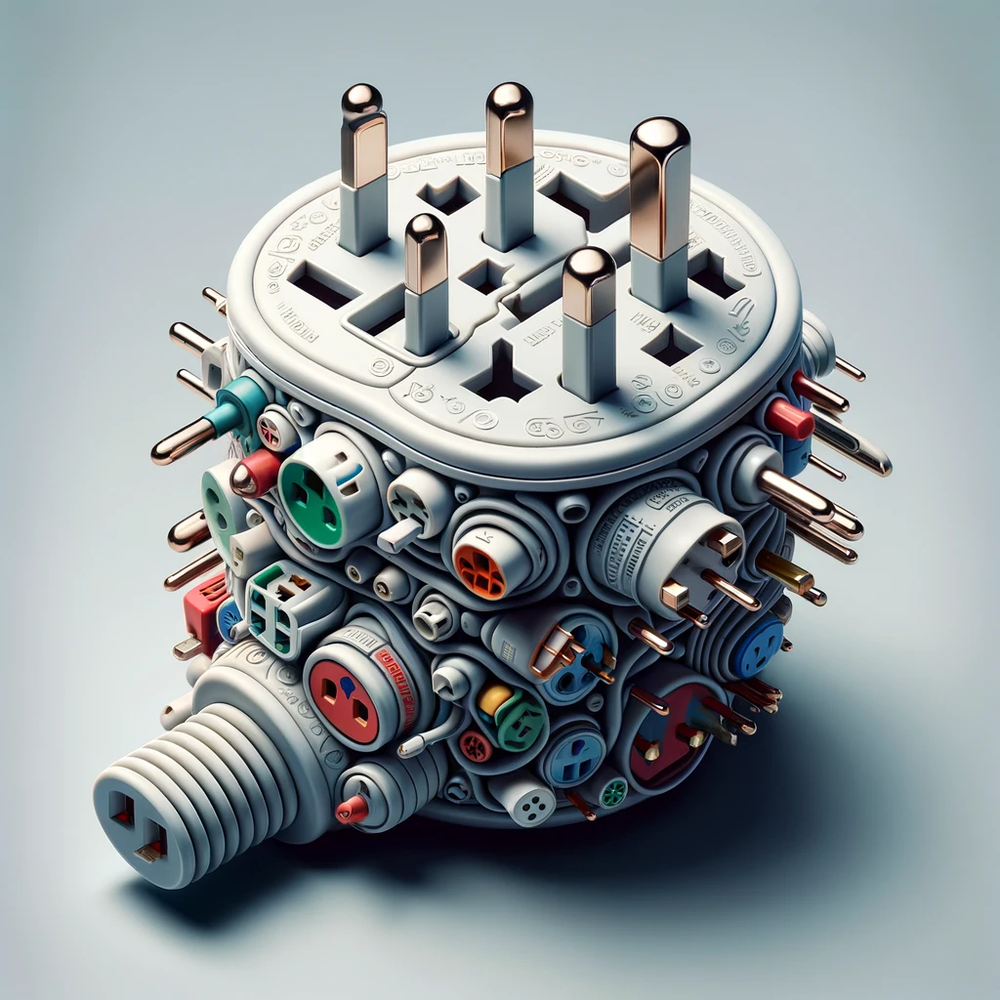

**Preview:**

**Used in:**

**Based Prompt:**
_Generate an image of a convoluted electrical plug. It should contain elements of socket conventions of different countries. I am trying to make a case for how confusing electrical sockets across the world are and I want an image that represents it well._

**Model used:** ChatGPT-4 with DALL-E

**Notes:**
1. I was imagining a plug where one prong is of US Type, one is Indian type, one is UK type, etc. However this does the job ok. The socket is funnily complicated and I am going to use it as is.

