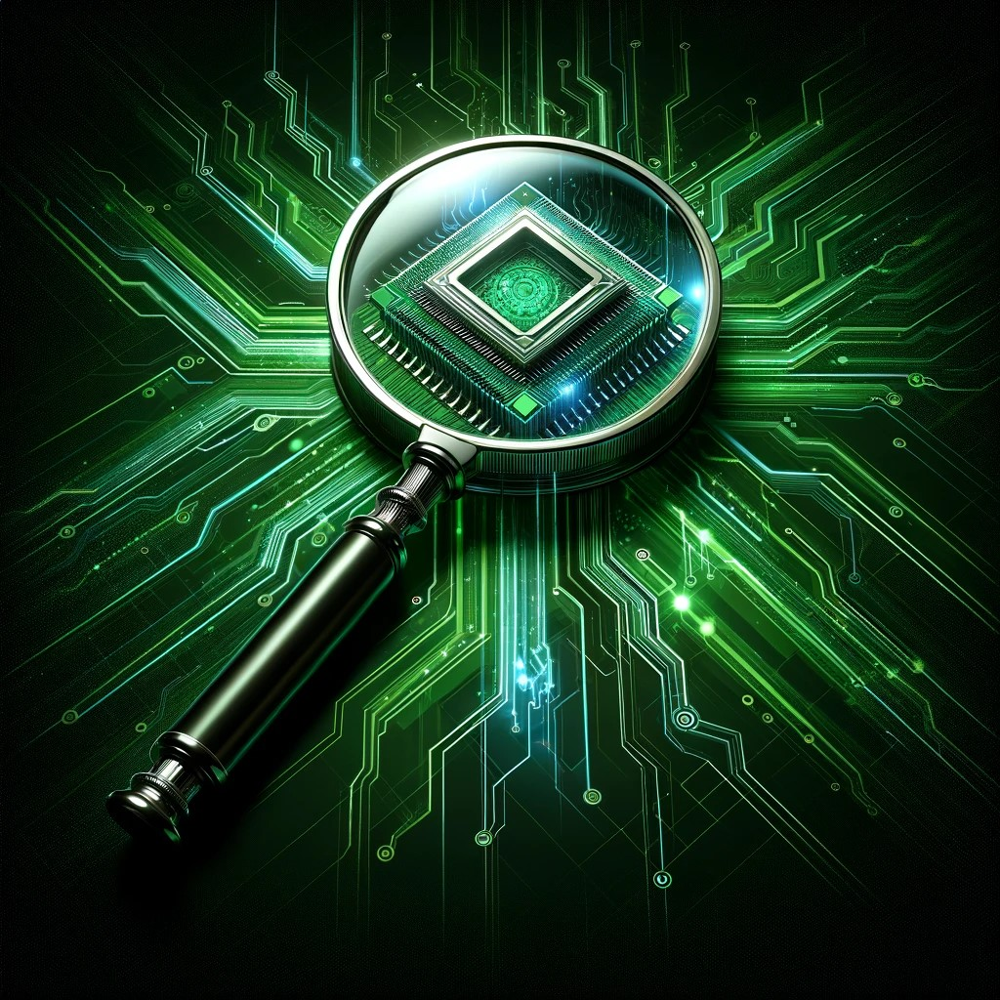

**Preview:**

**Used in:**
[Blog: Title](blog url)

**Base Prompt:**
_An image of a magnifying glass. The magnifying glass has digital connections coming out of it, similar to how one would represent a CPU. I want the image in the style of the "matrix" movie - in greens on a dark background._

**Model Used:** ChatGPT 4 with DALL-E

**Notes:**
1. I wanted this initially in ASCII art style. But it actually drew this as an ASCII art and it looked horrible. 
2. I also tried to remove the microchip from the center, but it wouldn't do so. So I decided to leave it in.
